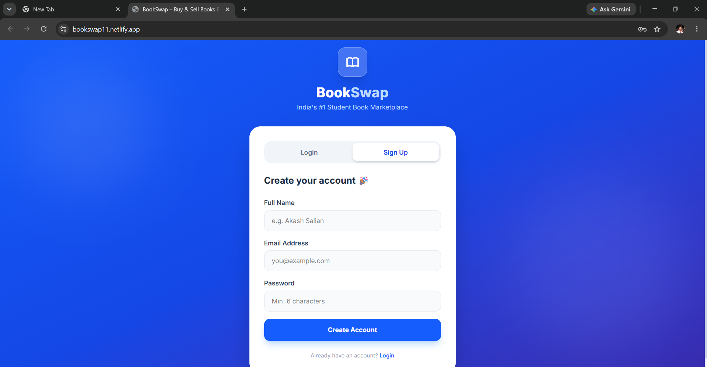
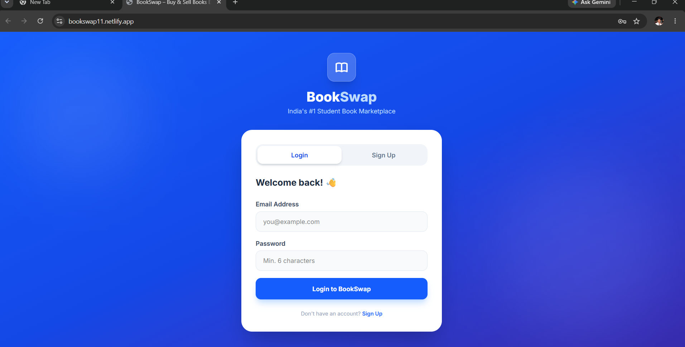
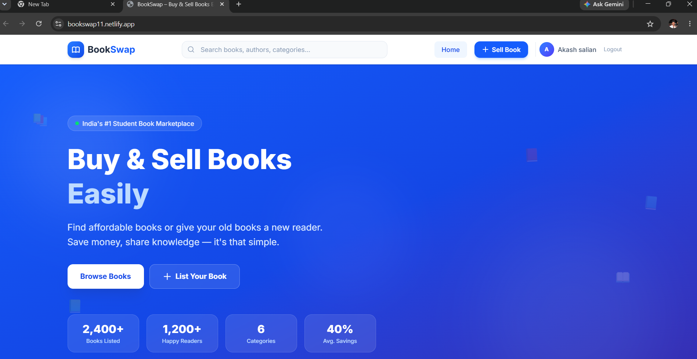
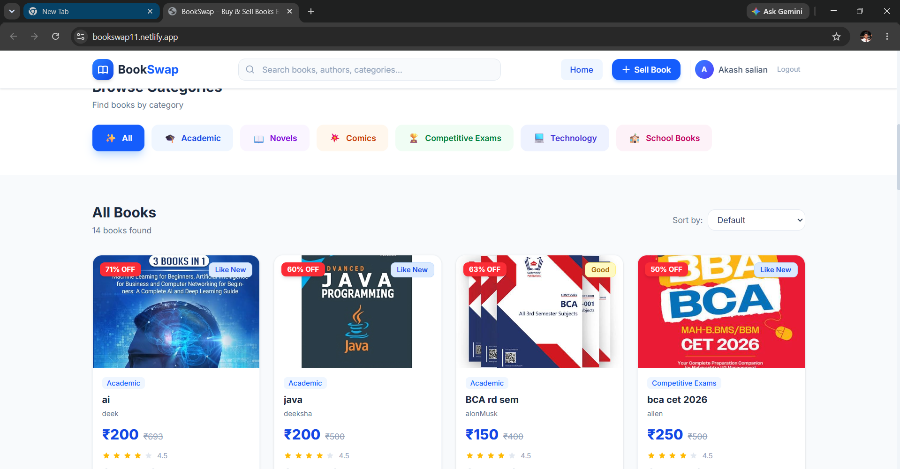
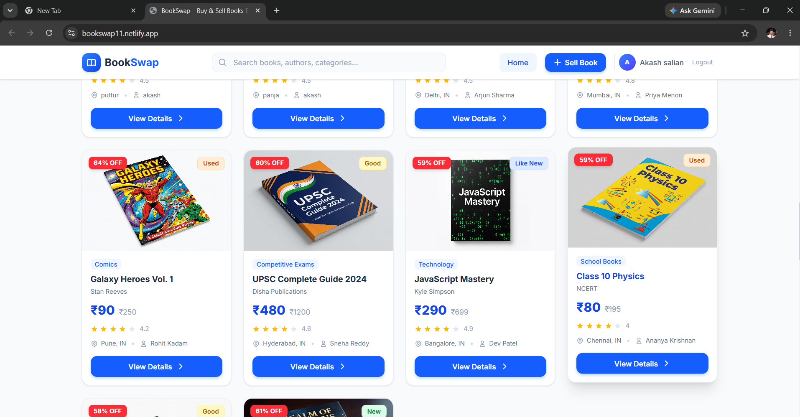
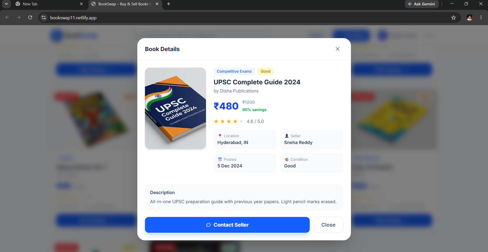
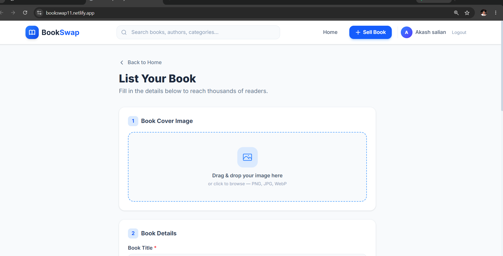
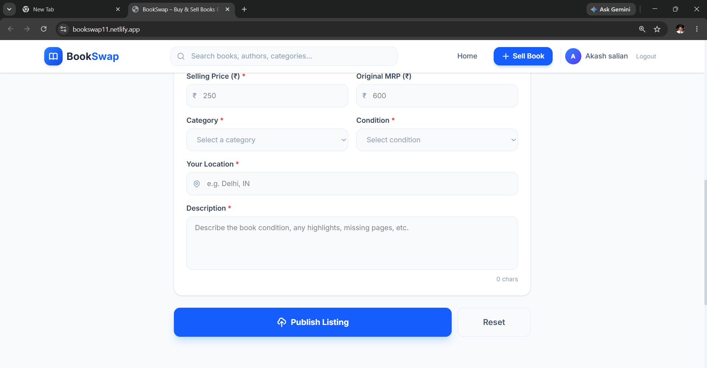

# BookSwap

BookSwap is a modern web application that allows users to buy, sell, and exchange books online. The platform provides an easy way for students and book lovers to discover affordable books while giving sellers a place to list their books.

## Live Demo

🔗 https://bookswap11.netlify.app

## Features

* User Authentication with Supabase
* Email Verification
* Browse Available Books
* Sell Books Online
* Search and Filter Books
* Responsive Design
* Fast and Modern User Interface
* Secure Cloud Database using Supabase

## Tech Stack

### Frontend

* React
* TypeScript
* Vite
* Tailwind CSS

### Backend & Database

* Supabase
* PostgreSQL Database
* Supabase Authentication

### Deployment

* Netlify

## Screenshots

### Signup Page

### Login Page

### Home Page

### Listed books Page

### Listed books Page

### Book details Page

### Book listing Page

### Book listing Page



## 📂 Project Structure

```text
src/
├── components/
├── pages/
├── lib/
├── data/
├── utils/
├── App.tsx
└── main.tsx
```

## ⚙️ Installation

Clone the repository:

```bash
git clone https://github.com/Akashsalian/Book-swap.git
```

Navigate to the project:

```bash
cd Book-swap
```

Install dependencies:

```bash
npm install
```

Start development server:

```bash
npm run dev
```

Build for production:

```bash
npm run build
```

## 🔐 Environment Variables

Create a `.env` file:

```env
VITE_SUPABASE_URL=your_supabase_url
VITE_SUPABASE_KEY=your_supabase_anon_key
```

## 🎯 Future Enhancements

* Book Reviews and Ratings
* Chat Between Buyers and Sellers
* Wishlist Feature
* Payment Integration
* Advanced Search Filters
* Book Recommendations

## 👨‍💻 Developer

**Akash Salian**

GitHub: https://github.com/Akashsalian

## 📄 License

This project is developed for educational and portfolio purposes.
